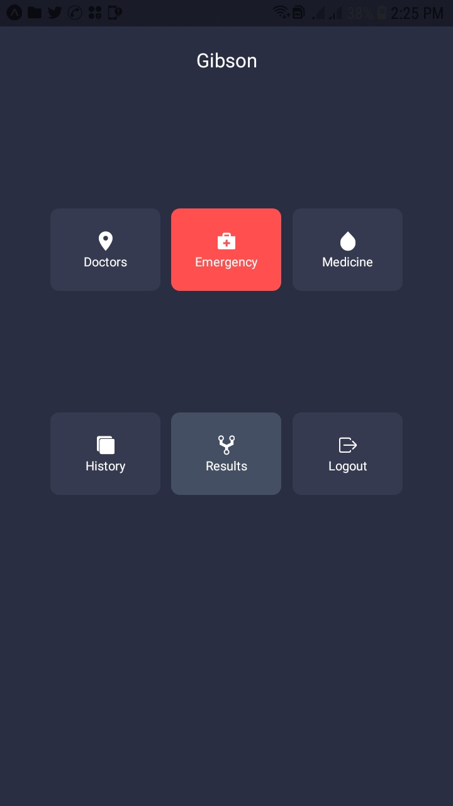
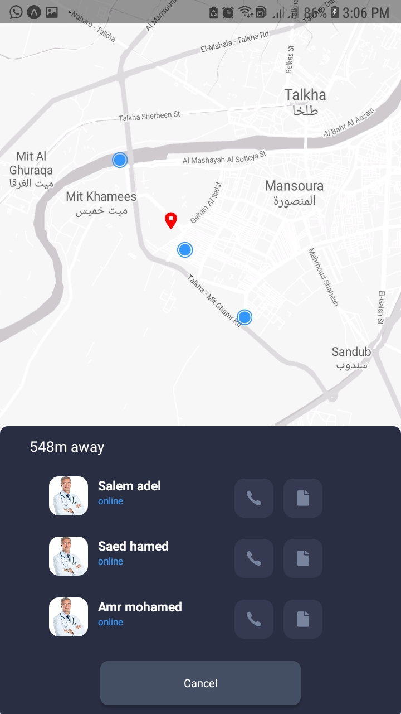
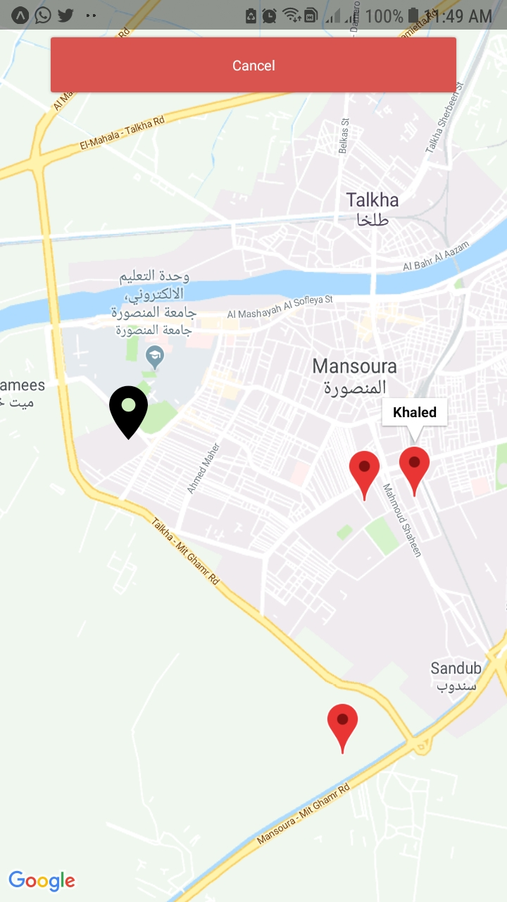
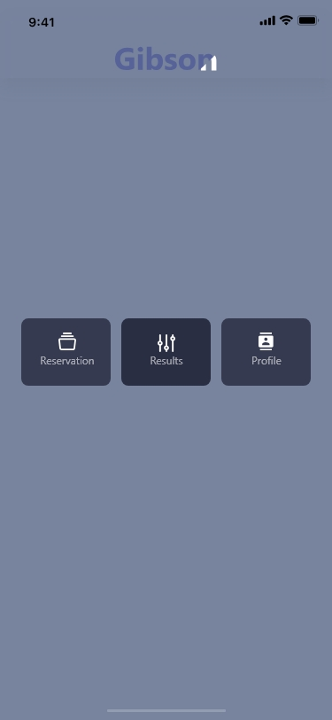
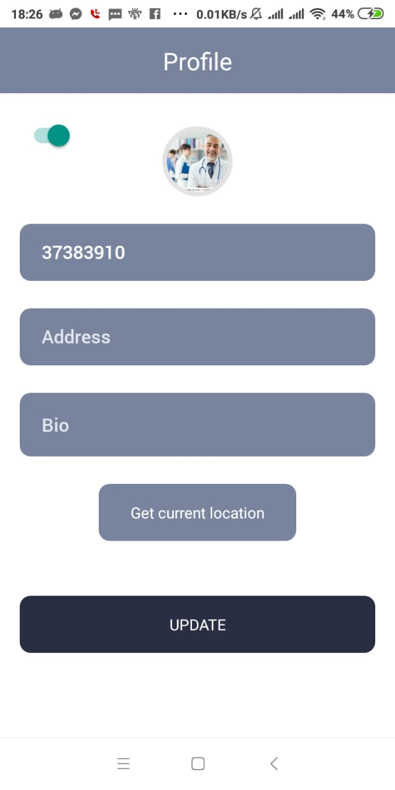
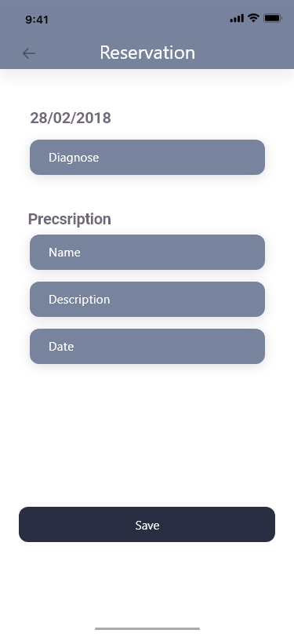
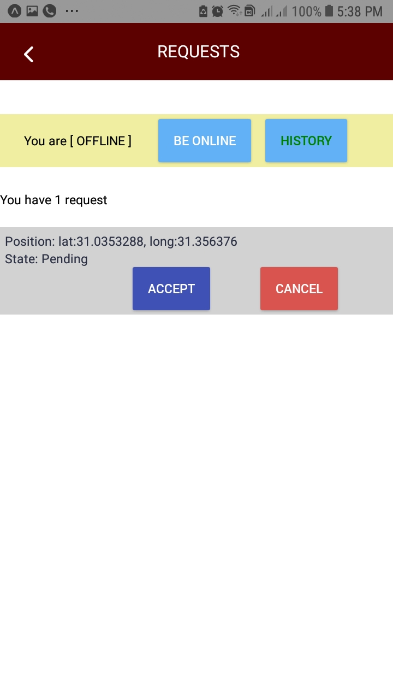
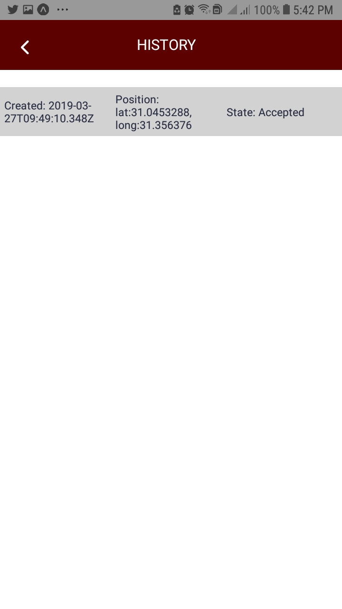

# Gibson
Cross platform Mobile Medical Application.

Gibson Documentation: <a href="https://github.com/khaledalam/Gibson/blob/master/Gibson%20Documentation.pdf">pdf</a> - <a href="https://docs.google.com/document/d/1M2r37pOT5EhYCq9zYWRSnCWDsw63Q9kfnKOZKeE3YoA/edit?usp=sharing">google doc</a>

## Apps:
- <a href="https://expo.io/@ninjo/Gibson-Patient">Patient</a> - <a href="https://github.com/khaledalam/Gibson/tree/master/Codes/Patient">code</a>
- <a href="https://expo.io/@xxsiders/Gibson-Doctor">Doctor</a> - <a href="https://github.com/khaledalam/Gibson/tree/master/Codes/Doctor">code</a>
- <a href="https://expo.io/@ninjo/gibson-emergency">Emergency</a> - <a href="https://github.com/khaledalam/Gibson/tree/master/Codes/Emergency">code</a>

## screenshots:
| Patient(<a href="Screenshots/patient">more</a>)  | .. | .. |
| ------------- | ------------- | ------------- |
| |   |  |

| Doctor(<a href="Screenshots/doctor">more</a>)  | .. | .. |
| ------------- | ------------- | ------------- |
| |   |  |

| Emergency(<a href="Screenshots/emergency">more</a>)  | .. | .. |
| ------------- | ------------- | ------------- |
| |   |  |
