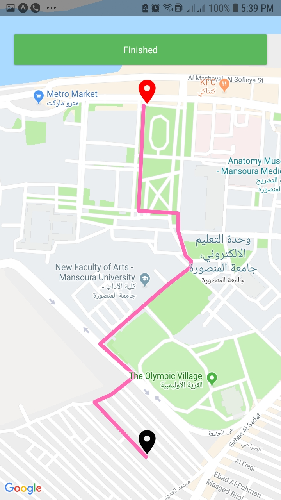

# Gibson
Cross platform Mobile Medical Application.

Gibson Documentation: <a href="https://github.com/khaledalam/Gibson/blob/master/Gibson%20Documentation.pdf">pdf</a> - <a href="https://docs.google.com/document/d/1M2r37pOT5EhYCq9zYWRSnCWDsw63Q9kfnKOZKeE3YoA/edit?usp=sharing">google doc</a>

## Apps:
- <a href="https://github.com/khaledalam/Gibson/tree/master/Codes/Patient">Patient</a>
- <a href="https://github.com/khaledalam/Gibson/tree/master/Codes/Doctor">Doctor</a>
- <a href="https://github.com/khaledalam/Gibson/tree/master/Codes/Emergency">Emergency</a>

## screenshots:
| Patient  | <a href="Screenshots/patient">more patient screenshots</a> |
| ------------- | ------------- |
| | l  |

| Doctor  | <a href="Screenshots/doctor">more doctor screenshots</a> |
| ------------- | ------------- |
| | l  |

| Emergency  | <a href="Screenshots/emergency">more emergency screenshots</a> |
| ------------- | ------------- |
| | l  |
